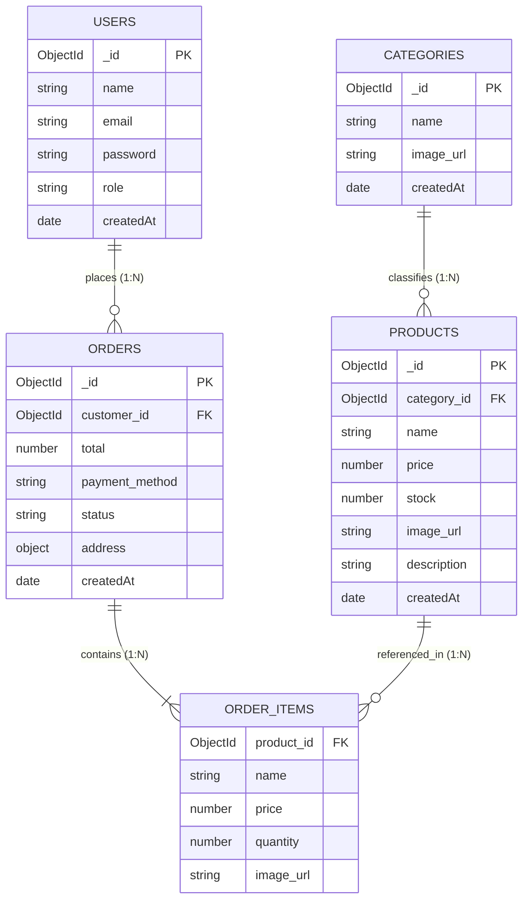
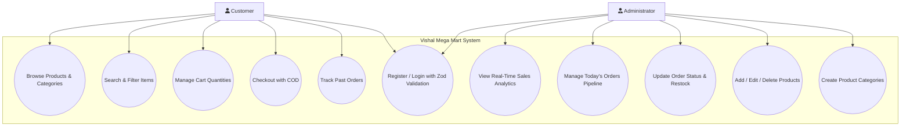
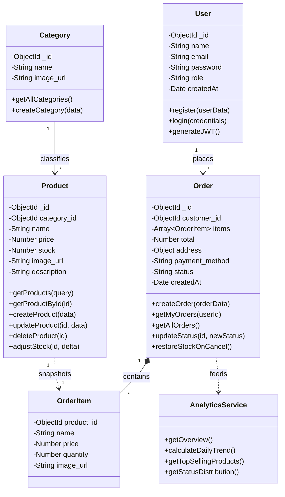
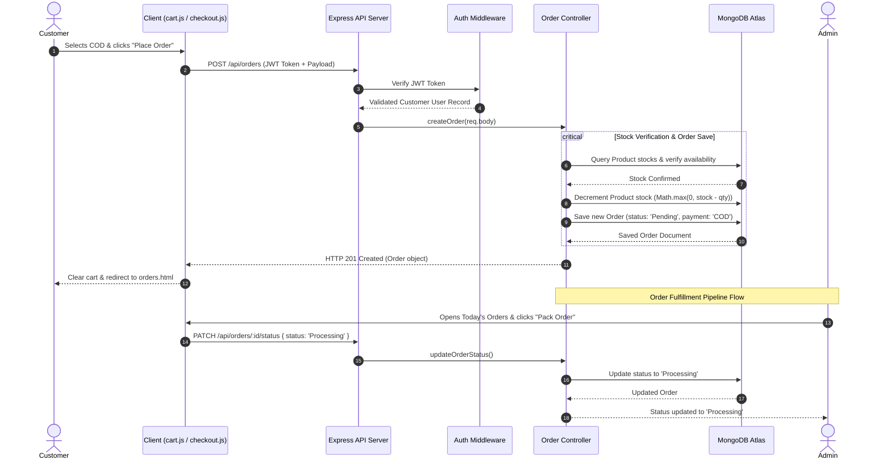

# A PROJECT REPORT ON
# “Vishal Mega Mart”
### An E-Commerce Online Grocery Shopping & Order Fulfillment Management Platform

**IN PARTIAL FULFILLMENT OF THE**  
**TYBCA (Science)**  
**Savitribai Phule Pune University**  
**Academic Year 2025–2026**

---

### SUBMITTED BY:
- **Aryan Shinde** (Seat No: 13470)
- **Shravan Choudhary** (Seat No: 13461)
- **Vishal Dewasi** (Seat No: 13488)

### UNDER THE GUIDANCE OF:
**Mrs. Aparna Gohad**

**Department of Computer Science**  
**MES’ Abasaheb Garware College (Autonomous)**  
Karve Road, Pune – 411004

---

<div style="page-break-after: always;"></div>

# INDEX

| Sr. No. | Contents |
| :---: | :--- |
| **I.** | **Acknowledgement** |
| **II.** | **College Certificate** |
| **1.** | **Introduction** |
| | 1.1 Existing System |
| | 1.2 Need of New System |
| **2.** | **Problem Definition** |
| **3.** | **Proposed System** |
| | 3.1 Explanation |
| | 3.2 Methodology Used |
| **4.** | **Scope of the System** |
| | 4.1 Functional Scope |
| | 4.2 Technical Scope |
| | 4.3 Out of Scope |
| **5.** | **Hardware and Software Requirements** |
| | 5.1 Hardware Requirements |
| | 5.2 Software Requirements |
| **6.** | **Fact Finding Techniques** |
| **7.** | **Feasibility Study** |
| | 7.1 Operational Feasibility |
| | 7.2 Technical Feasibility |
| | 7.3 Economical Feasibility |
| **8.** | **System Diagrams** |
| | 8.1 Entity-Relationship (E-R) Diagram |
| | 8.2 Use Case Diagram |
| | 8.3 Class Diagram |
| | 8.4 Sequence Diagram |
| **9.** | **Database Designing** |
| | 9.1 Collection: `users` |
| | 9.2 Collection: `categories` |
| | 9.3 Collection: `products` |
| | 9.4 Collection: `orders` |
| **10.** | **Screen Designing** |
| | 10.1 Input / Output Screen Designing |
| | 10.2 Output Formats & REST API Payloads |
| **11.** | **Test Cases Design** |
| | 11.1 Authentication & Zod Schema Validation |
| | 11.2 Catalog & Product Inventory |
| | 11.3 Customer Shopping Cart & COD Checkout |
| | 11.4 Admin Order Fulfillment & Automated Stock Restoration |
| | 11.5 Real-Time Sales Analytics |
| **12.** | **Limitations of the System** |
| **13.** | **Conclusions and Future Enhancements** |
| **14.** | **Bibliography and References** |

---

<div style="page-break-after: always;"></div>

# Acknowledgement

We would like to express our heartfelt gratitude to everyone who supported and guided us throughout the development of our project, **“Vishal Mega Mart — Online Grocery Shopping & Store Management System”**.

First and foremost, we extend our sincere appreciation to our project guide, **Mrs. Aparna Gohad**, for her invaluable guidance, constructive advice, constant encouragement, and insightful feedback. Her support throughout the software development life cycle helped us architect and build a production-quality, secure, and robust full-stack web application.

We also extend our sincere thanks to the **Head of Department** and all faculty members of the **Department of Computer Science** at **M.E.S. Abasaheb Garware College (Autonomous)** for providing the necessary computing resources, academic support, and encouragement.

Finally, we are grateful to each other as a team for our collaborative effort, tireless commitment, and perseverance that made this project a success.

---

**With regards,**

- **Aryan Shinde** (13470)  
- **Shravan Choudhary** (13461)  
- **Vishal Dewasi** (13488)  

*TYBCA (Science), Department of Computer Science*  
*MES’ Abasaheb Garware College, Pune*

---

<div style="page-break-after: always;"></div>

# College Certificate

<div align="center">

### MAHARASHTRA EDUCATION SOCIETY’S
## ABASAHEB GARWARE COLLEGE (AUTONOMOUS)
**Karve Road, Deccan Gymkhana, Pune – 411 004, Maharashtra, India**  
*NAAC Re-Accredited ‘A’ Grade \| Best College Award – Savitribai Phule Pune University*

---

### DEPARTMENT OF COMPUTER SCIENCE

</div>

This is to certify that the project entitled:

### **“Vishal Mega Mart — Online Grocery Shopping & Order Fulfillment Management Platform”**

Submitted by the following students:

1. **Aryan Shinde** — Seat No: **13470**
2. **Shravan Choudhary** — Seat No: **13461**
3. **Vishal Dewasi** — Seat No: **13488**

is a bonafide work completed in partial fulfillment of the requirements for the award of the degree of **Bachelor of Computer Applications (Science) — TYBCA (Sem-VI)** of **Savitribai Phule Pune University** during the academic year **2025–2026**.

<br><br><br>

| _______________________ <br> **Mrs. Aparna Gohad** <br> (Project Guide) | _______________________ <br> **Head of Department** <br> (Department of Computer Science) |
| :---: | :---: |
| <br><br> _______________________ <br> **Internal Examiner** | <br><br> _______________________ <br> **External Examiner** |

---

<div style="page-break-after: always;"></div>

# 1. Introduction

**Vishal Mega Mart** is a modern, responsive, full-stack e-commerce web application engineered to digitalize the daily grocery shopping experience for consumers while providing store managers with an automated fulfillment pipeline and real-time sales intelligence.

The platform provides a consumer-facing digital supermarket where shoppers can browse fresh produce, dairy, staples, snacks, and household essentials, filter items by category, manage quantities in an interactive cart, and place orders with doorstep **Cash on Delivery (COD)** payment.

On the operational side, the system introduces an **Admin Central Command Dashboard** with a dedicated sidebar navigation shell. Store administrators can monitor live sales metrics, track today's order velocity, update catalog inventory and pricing, and advance orders through a multi-stage fulfillment pipeline (`Pending` &rarr; `Processing` &rarr; `Shipped` &rarr; `Delivered`), with automated warehouse inventory restock handling upon order cancellations.

### 1.1 Existing System

Traditional brick-and-mortar grocery stores and legacy catalog websites rely heavily on manual paper-based ledgers or static websites:

1. **Static Catalogs**: Legacy websites display hardcoded HTML product lists. Any price change, stock update, or new product addition requires manual code editing and web server redeployment.
2. **Manual Counter Slips**: Orders placed over phone or counter are written by hand on paper slips, resulting in calculation errors, misread items, and lost records.
3. **No Live Stock Synchronization**: When items sell out, the physical shelf or static website fails to alert customers, leading to customer dissatisfaction when items cannot be fulfilled.
4. **Lack of Sales Intelligence**: Shopkeepers calculate daily turnover manually at closing time by counting cash in drawers, lacking analytics on top-performing items, peak order hours, or category revenue distribution.
5. **Vulnerable Access Control**: Basic websites lack role-based access control, allowing any public visitor or unauthorized employee access to management settings.

### 1.2 Need of New System

To resolve these operational bottlenecks, **Vishal Mega Mart** was engineered with the following objectives:

- **Interactive Customer Experience**: Enable customers to search, filter by department, inspect product details, adjust cart quantities, and track orders seamlessly on desktop and mobile devices.
- **Strict Cash on Delivery (COD) Model**: Streamline payment handling by eliminating unstable third-party payment gateway drop-offs and ensuring zero transaction fee deductions.
- **Robust Schema Validation (Zod)**: Enforce strict backend input verification to eliminate malformed payloads, invalid emails, and weak passwords (minimum 8 characters with required alphanumeric mix).
- **Protected Administrator Gatekeeping**: Shield admin registration using a secure server-side administrative key (`ADMIN_SECURITY_KEY`), preventing unauthorized privilege escalation.
- **Dynamic Order Fulfillment Pipeline**: Equip store staff with step-by-step order progression (`Pack Order` &rarr; `Dispatch` &rarr; `Deliver & Collect COD`) and itemized receipts.
- **Automated Inventory Restocking**: Automatically increment warehouse catalog stock if an order is cancelled, preventing inventory discrepancies.
- **Real-Time Database Analytics**: Provide executive dashboards displaying gross volume, delivered net revenue, today's sales, average order value (AOV), top-selling products leaderboard, and 7-day sales trends computed directly from live MongoDB records without mock/seed scripts.

---

<div style="page-break-after: always;"></div>

# 2. Problem Definition

In modern retail and grocery distribution, operational friction occurs when consumer purchasing demands and warehouse fulfillment operate on disconnected systems. Specifically, the following problems were addressed:

1. **Inventory Discrepancy & Over-selling**: In manual systems, items sold out in the store remain visible on the customer list. Customers purchase items that cannot be delivered, creating customer dissatisfaction and refund complications.
2. **Insecure Authentication & Weak Passwords**: Many academic or commercial retail platforms employ lax validation, allowing single-character passwords, unverified email formats, or open administrative registration.
3. **Payment Drop-offs & Gateway Failures**: Third-party payment gateways in localized grocery delivery often suffer network timeouts, OTP delays, and transaction processing fees. A streamlined Cash on Delivery mechanism with strict verification addresses this friction.
4. **Uncontrolled Order State Transitions**: Without a formalized finite-state machine, orders can erroneously jump from `Delivered` back to `Pending`, or `Cancelled` orders fail to restore reserved stock back to the warehouse catalog.
5. **Static or Simulated Analytics**: Store owners are often given hardcoded dashboards displaying static numbers rather than live calculations derived from actual database records.

---

<div style="page-break-after: always;"></div>

# 3. Proposed System

### 3.1 Explanation

The proposed **Vishal Mega Mart** platform is architected as an MVC (Model-View-Controller) RESTful web application. It delivers three distinct operational tiers:

```
+-----------------------------------------------------------------------+
|                           VISHAL MEGA MART                            |
+-----------------------------------+-----------------------------------+
|       PUBLIC / CUSTOMER TIER      |      ADMINISTRATOR COMMAND TIER   |
|   - Real-time Catalog Browsing    |   - Executive Sales Analytics     |
|   - Category & Keyword Search     |   - Today's Orders Pipeline       |
|   - Interactive Cart Management   |   - Order Fulfillment Progression |
|   - Free Delivery Calculation     |   - Auto-Restock on Cancellation  |
|   - COD Doorstep Checkout         |   - Product & Inventory CRUD      |
|   - Real-time Order Tracking      |   - Dynamic Category Management   |
|   - Secure Registration & Login   |   - Secret Key Admin Gatekeeping  |
+-----------------------------------+-----------------------------------+
```

#### A. Public & Customer Experience:
- **Homepage (`index.html`)**: Dynamic hero banner, category pill buttons, featured products grid, and value propositions (Free Delivery over ₹499, 100% Quality Guarantee, Cash on Delivery).
- **Catalog Page (`products.html`)**: Filter products by category, live keyword search, dynamic price sorting, and instant stock indicators (`In Stock`, `Low Stock ≤ 10`, `Out of Stock`).
- **Product Detail (`product.html`)**: Single item breakdown, high-resolution imagery, description, unit price, stock counter, and dynamic quantity selector.
- **Cart (`cart.html`)**: Reactive shopping cart computing unit totals, delivery fee waiver logic, and persistent storage in browser `localStorage`.
- **Checkout (`checkout.html`)**: Complete delivery address entry with PIN code validation, transparent COD summary card, and single-click order placement.
- **Order History (`orders.html`)**: Customer ledger displaying past orders, item snapshots, order date, current fulfillment stage indicator, and total COD amount.
- **Authentication (`login.html`)**: Dual customer login and registration portal featuring client-side and server-side Zod validation with real-time error hints.

#### B. Administrative Operations:
- **Sidebar Shell (`admin.html`)**: Sticky sidebar navigation with quick stats badges, responsive mobile drawer, and view switching across **Sales Analytics**, **Today's Orders**, and **Catalogue**.
- **Real-Time Sales Analytics**: Dynamic aggregation endpoint (`/api/orders/analytics/overview`) computing delivered net revenue, today's sales, average order value, total units sold, 7-day revenue trend bar chart, and top-selling product leaderboard.
- **Order Fulfillment Pipeline**: Searchable fulfillment table with stage progression buttons (`Pack Order` &rarr; `Dispatch` &rarr; `Deliver & Collect COD`, and `Cancel Order`).
- **Automated Stock Restoration**: Cancelling an order automatically restores all item quantities to warehouse catalog stock using MongoDB `$inc`.
- **Detailed Receipt Modal**: Inspects order reference, customer profile, delivery address, itemized breakdown with pictures, pricing, and fulfillment timeline.

---

### 3.2 Methodology Used

The project was developed following the **Iterative and Incremental Development Methodology**. Rather than a rigid waterfall approach, the system was implemented in prioritized functional sprints where each iteration delivered a fully tested, verified capability before proceeding to the next.

```
+--------------------+      +--------------------+      +--------------------+
| 1. Requirement     | ---> | 2. System Design   | ---> | 3. Iterative Build |
| Analysis & Scope   |      | Schema, API Routes |      | Backend + Frontend |
+--------------------+      +--------------------+      +--------------------+
                                                                   |
                                                                   v
+--------------------+      +--------------------+      +--------------------+
| 6. Final Audit &   | <--- | 5. Deployment &    | <--- | 4. Automated &     |
| Academic Delivery  |      | Verification       |      | Manual Testing     |
+--------------------+      +--------------------+      +--------------------+
```

- **Phase 1 — Requirement Analysis**: Identified pain points in grocery retail: inventory management, address capture, COD verification, and order stage progression.
- **Phase 2 — System Architecture & Schema Design**: Designed Mongoose schemas for `User`, `Category`, `Product`, and `Order`, defining relationship constraints and indexes.
- **Phase 3 — Core Iteration Sprints**:
  - *Sprint 1*: Database connection, auto-seeding helper, and secure user authentication with bcrypt and JWT.
  - *Sprint 2*: Product and category REST endpoints with search and filtering.
  - *Sprint 3*: Shopping cart state, checkout validation, and COD order placement.
  - *Sprint 4*: Admin order fulfillment pipeline, status finite-state machine, and stock cancellation restock logic.
  - *Sprint 5*: Zod validation integration, custom 404 page, and zero-emoji compliance.
  - *Sprint 6*: Admin dashboard redesign with sidebar, Today's Orders view, and MongoDB aggregation analytics.
- **Phase 4 — Testing & Quality Assurance**: Automated API test suite (`test-api.js`), client static routes test (`test-client.js`), and Node.js VM syntax verification.
- **Phase 5 — Deployment & Packaging**: Environment isolation, `.gitignore` setup, and local production-mode verification on Node.js port 5050.

---

<div style="page-break-after: always;"></div>

# 4. Scope of the System

### 4.1 Functional Scope
- **Dynamic Catalog**: Real-time retrieval of grocery products categorized under Fruits & Vegetables, Dairy & Bakery, Staple Grains, Snacks & Munchies, Beverages, and Household Care.
- **Search & Filtering**: Keyword search across titles and category dropdown filtering without full page reloads.
- **Cart Management**: Add to cart, real-time quantity adjustment, stock limit enforcement, and item removal.
- **Doorstep COD Checkout**: Full shipping address capture (Name, Phone, Street, City, State, PIN Code) with automated delivery fee calculation (Free above ₹499, else ₹40).
- **Role-Based Authentication**: Customer registration and login; Admin registration strictly protected by an administrative secret passkey (`ADMIN_SECURITY_KEY`).
- **Strict Input Validation**: Backend Zod schemas enforcing 8+ alphanumeric characters, valid email formats, and required shipping parameters.
- **Admin Fulfillment Pipeline**: Structured order progression (`Pending` &rarr; `Processing` &rarr; `Shipped` &rarr; `Delivered`), cancellation rejection of terminal states, and automatic catalog restock.
- **Live Business Analytics**: Total delivered turnover, today's sales, average order value, units sold, 7-day sales graph, and top-selling product ranking.

### 4.2 Technical Scope
- **Architecture**: Decoupled Model-View-Controller (MVC) architecture with standard RESTful JSON API endpoints.
- **Backend**: Node.js runtime with Express.js web framework.
- **Database**: MongoDB NoSQL document database utilizing Mongoose Object Data Modeling (ODM).
- **Security**: Cryptographic password hashing using `bcryptjs` (salt rounds = 10), stateless token authentication via `jsonwebtoken` (JWT), and HTTP bearer authentication headers.
- **Input Validation**: `zod` runtime schema parsing and error response formatting.
- **Frontend**: Standard HTML5, CSS3, Vanilla JavaScript (ES6+), and Tailwind CSS utility styling.
- **Error Handling**: Branded custom `404.html` page served on unmapped routes with HTTP 404 status.

### 4.3 Out of Scope
- Online card processing or payment gateway integration (Stripe / Razorpay) — deliberately excluded to focus on pure Cash on Delivery (COD).
- Native iOS or Android mobile application (the web app is fully responsive on mobile browsers).
- GPS-based real-time delivery rider tracking.
- Multi-vendor marketplace support (the system is designed for single-store retail operations).

---

<div style="page-break-after: always;"></div>

# 5. Hardware and Software Requirements

### 5.1 Hardware Requirements

#### Development & Server Machine:
| Component | Minimum Specification | Recommended Specification |
| :--- | :--- | :--- |
| **Processor** | Dual Core 2.0 GHz (Intel i3 / AMD Ryzen 3 / Apple M1) | Quad Core 2.5 GHz+ (Intel i5/i7 / Apple Silicon) |
| **RAM** | 4 GB DDR4 | 8 GB or 16 GB DDR4/Unified |
| **Hard Disk Space** | 5 GB available storage | 20 GB SSD storage |
| **Network Interface** | Standard Broadband / Wi-Fi connection | High-speed Broadband (10 Mbps+) |
| **Display Monitor** | 1366 &times; 768 resolution | 1920 &times; 1080 Full HD |

#### Client / End-User Device:
- Any internet-connected device (Desktop, Laptop, Tablet, or Smartphone) running a modern web browser.

---

### 5.2 Software Requirements

| Category | Technology / Specification | Purpose |
| :--- | :--- | :--- |
| **Operating System** | macOS 14+, Windows 10/11, Ubuntu Linux 20.04+ | Development & Execution Platform |
| **Backend Runtime** | Node.js (v18.x or v20.x LTS) | Server-side JavaScript Engine |
| **Web Framework** | Express.js (v4.x) | HTTP Routing & REST API Middleware |
| **Database** | MongoDB (v6.x / Atlas Cloud Cluster) | NoSQL Document Database |
| **Database ODM** | Mongoose (v8.x) | Schema Modeling & Type Validation |
| **Authentication** | JSON Web Tokens (`jsonwebtoken` v9.x) | Stateless Bearer Authentication |
| **Password Hashing** | `bcryptjs` (v2.4.x) | One-way Password Encryption |
| **Input Validation** | `zod` (v3.23.x) | Runtime Request Schema Validation |
| **Frontend Languages** | HTML5, CSS3, Vanilla JavaScript (ES6+) | User Interface & Client-side Logic |
| **CSS Utility Framework** | Tailwind CSS (CDN v3.x) | Responsive Layout & Micro-interactions |
| **Development Tools** | Visual Studio Code, Postman, Git | Source Editing, API Testing & VCS |

---

<div style="page-break-after: always;"></div>

# 6. Fact Finding Techniques

To build a practical and accurate grocery ordering solution, several fact-finding methodologies were utilized:

1. **Observation**:  
   The team observed the physical checkout and fulfillment operations at a local supermarket. Customers frequently asked for stock availability, queued for manual bill generation, and spent significant time waiting for counter clerks to verify item prices. This highlighted the need for real-time stock indicators and instant digital order placement.

2. **Interviews**:  
   Informal discussions were conducted with grocery store counter staff and shoppers:
   - *Staff Insights*: Staff emphasized that online order cancellations happen frequently and that remembering to manually add cancelled stock back to the physical shelf is prone to human error. This led directly to our **Automated Stock Restoration** feature on order cancellation.
   - *Customer Insights*: Shoppers noted that online payment gateways often fail due to banking server timeouts or SMS OTP delays. They expressed high preference for Cash on Delivery (COD) for grocery essentials.

3. **Document & Receipt Study**:  
   Physical cash memos and retail tax invoices were collected and analyzed. This established the essential attributes required in our database schema: product description, unit price, quantity, category, customer address with PIN code, and financial breakdowns (subtotal, delivery fee, and net total).

4. **Iterative Prototype Review**:  
   Wireframes and interactive UI mockups were reviewed with peers and academic evaluators. Feedback resulted in creating the collapsible Admin Sidebar, dynamic status filter tabs (`Pending`, `Processing`, `Shipped`, `Delivered`, `Cancelled`), and the full receipt inspection modal.

---

<div style="page-break-after: always;"></div>

# 7. Feasibility Study

### 7.1 Operational Feasibility
The system is operationally feasible for all user categories:
- **Customers**: Requires no technical training or software installation. Customers access the web portal via any browser, browse groceries, add to cart, and checkout with COD.
- **Store Administrators & Staff**: The Admin Command Center provides intuitive status buttons (`Pack Order`, `Dispatch`, `Deliver & Collect COD`), real-time search, and visual sales graphs. Complex operations like database indexing, JWT token decoding, and stock updates happen automatically.

### 7.2 Technical Feasibility
The chosen tech stack is proven, robust, and industry-standard:
- **Node.js & Express.js**: Non-blocking, event-driven I/O capable of handling concurrent requests with minimal resource consumption.
- **MongoDB & Mongoose**: Flexible document model well-suited for nested product order snapshots and dynamic aggregations.
- **Tailwind CSS & Vanilla JavaScript**: Avoids heavy frontend build dependencies, ensuring instant page loading, responsive design across mobile/desktop, and maintainable code.

### 7.3 Economical Feasibility
The platform is economically viable:
- **Zero Software Licensing Costs**: All technologies used (Node.js, Express, MongoDB Community/Atlas, Tailwind CSS, Zod, Git) are open-source and free of licensing fees.
- **Hosting Options**: The application can run on cloud free-tier hosting (Render / Vercel / Railway) and MongoDB Atlas Free Cluster (512 MB storage), incurring **₹0** infrastructure cost for academic and prototype deployment.
- **Direct Business ROI**: Digitalizing order intake and stock tracking eliminates paper bill stationery costs and minimizes revenue loss from unfulfilled orders.

---

<div style="page-break-after: always;"></div>

# 8. System Diagrams

### 8.1 Entity-Relationship (E-R) Diagram

The system comprises four primary entities: `USERS`, `CATEGORIES`, `PRODUCTS`, and `ORDERS`.



#### Entity Relationships:
1. **USERS to ORDERS (1:N)**: One registered customer can place multiple orders over time. Each order belongs to exactly one customer account.
2. **CATEGORIES to PRODUCTS (1:N)**: One product category (e.g., *Dairy & Bakery*) contains multiple products. Each product references one category via `category_id`.
3. **ORDERS to ORDER_ITEMS (1:N)**: An order contains an embedded array of item subdocuments.
4. **PRODUCTS to ORDER_ITEMS (Reference Snapshot)**: Each ordered item captures an immutable snapshot of `product_id`, `name`, `price`, and `quantity` at the time of order placement, ensuring historical accuracy even if catalog prices change later.

---

<div style="page-break-after: always;"></div>

### 8.2 Use Case Diagram



- **Customer Actor**: Can freely browse items, filter by department, add items to cart, register/login, place COD orders, and track order fulfillment history.
- **Administrator Actor**: Authenticates using the admin role and security secret passkey; monitors real-time sales intelligence; progresses orders through fulfillment stages; and manages catalog inventory and categories.

---

<div style="page-break-after: always;"></div>

### 8.3 Class Diagram



---

<div style="page-break-after: always;"></div>

### 8.4 Sequence Diagram: Order Placement & Fulfillment



---

<div style="page-break-after: always;"></div>

# 9. Database Designing

The database is built on **MongoDB** using **Mongoose ODM**. It consists of four production collections:

### 9.1 Collection: `users`
Stores registered customer accounts and verified administrators.

| Field Name | Data Type | Constraints | Description |
| :--- | :--- | :--- | :--- |
| `_id` | ObjectId | Primary Key, Auto | Unique user document identifier |
| `name` | String | Required, Trimmed | Full name of the customer or admin |
| `email` | String | Required, Unique, Lowercase | Login email address (indexed) |
| `password` | String | Required | Bcrypt-hashed password (salt rounds = 10) |
| `role` | String | Enum: `['customer', 'admin']` | User authorization role (default: `'customer'`) |
| `createdAt` | Date | Auto (timestamps: true) | Timestamp of registration |
| `updatedAt` | Date | Auto (timestamps: true) | Timestamp of last profile update |

---

### 9.2 Collection: `categories`
Stores product categories displayed across the customer navigation and admin filters.

| Field Name | Data Type | Constraints | Description |
| :--- | :--- | :--- | :--- |
| `_id` | ObjectId | Primary Key, Auto | Unique category document identifier |
| `name` | String | Required, Unique, Trimmed | Category department title (e.g. *Dairy & Bakery*) |
| `image_url` | String | Required, Trimmed | CDN / Cloud image thumbnail URL |
| `createdAt` | Date | Auto (timestamps: true) | Timestamp of category creation |
| `updatedAt` | Date | Auto (timestamps: true) | Timestamp of last category update |

---

### 9.3 Collection: `products`
Stores inventory items available for browsing and purchasing.

| Field Name | Data Type | Constraints | Description |
| :--- | :--- | :--- | :--- |
| `_id` | ObjectId | Primary Key, Auto | Unique product document identifier |
| `name` | String | Required, Trimmed, Indexed | Commercial grocery item title |
| `category_id` | ObjectId | Required, Ref: `Category` | Foreign key referencing parent category |
| `price` | Number | Required, Min: 0 | Selling price in Indian Rupees (₹) |
| `stock` | Number | Required, Min: 0 | Available inventory units in warehouse |
| `image_url` | String | Required, Trimmed | URL of high-resolution product photography |
| `description` | String | Optional, Trimmed | Product specifications, weight, and origins |
| `createdAt` | Date | Auto (timestamps: true) | Date item added to catalog |
| `updatedAt` | Date | Auto (timestamps: true) | Date item last modified |

---

### 9.4 Collection: `orders`
Stores customer orders, address records, item snapshots, and live fulfillment statuses.

| Field Name | Data Type | Constraints | Description |
| :--- | :--- | :--- | :--- |
| `_id` | ObjectId | Primary Key, Auto | Unique order document identifier |
| `customer_id` | ObjectId | Required, Ref: `User` | Foreign key referencing purchasing user |
| `items` | Array [Object] | Required, Non-empty | Embedded subdocuments of purchased items |
| `items.product_id`| ObjectId | Required, Ref: `Product` | Reference to original catalog product |
| `items.name` | String | Required (Snapshot) | Product name at time of order |
| `items.price` | Number | Required (Snapshot) | Unit price at time of order |
| `items.quantity` | Number | Required, Min: 1 | Number of units purchased |
| `items.image_url`| String | Optional | Item thumbnail image snapshot |
| `total` | Number | Required, Min: 0 | Total invoice amount in Indian Rupees (₹) |
| `address` | Object | Required | Shipping address document |
| `address.fullName`| String | Required, Trimmed | Recipient customer name |
| `address.phone` | String | Required, Trimmed | Contact phone number |
| `address.street`| String | Required, Trimmed | Door/Building/Street details |
| `address.city` | String | Required, Trimmed | Delivery city |
| `address.state`| String | Optional, Trimmed | State / Province |
| `address.pinCode`| String | Required, Trimmed | Postal Delivery PIN code |
| `payment_method`| String | Enum: `['COD']` | Payment method (Cash on Delivery only) |
| `status` | String | Enum: `['Pending', 'Processing', 'Shipped', 'Delivered', 'Cancelled']` | Fulfillment state machine status |
| `createdAt` | Date | Auto (timestamps: true) | Order placement timestamp |
| `updatedAt` | Date | Auto (timestamps: true) | Order status transition timestamp |

---

<div style="page-break-after: always;"></div>

# 10. Screen Designing

### 10.1 Input / Output Screen Designing

The frontend is constructed using clean, semantic HTML5, modern CSS3 styling, and reactive JavaScript components:

#### 1. Homepage (`client/index.html`)
- **Header**: Vishal Mega Mart brand mark, live search bar, category navigation bar, cart counter badge, and user authentication status pill.
- **Hero Banner**: Branded promotional headline, quick link to catalog, and trust badges (100% Quality, Free Delivery above ₹499, Cash on Delivery).
- **Category Explorer**: Grid of departmental categories pulling live icons and names from MongoDB.
- **Featured Products**: Reactive card grid displaying product photo, department tag, item name, price in ₹, stock badge, and one-tap **Add to Cart** button.

#### 2. Products Catalog (`client/products.html`)
- **Filter Controls**: Category dropdown selector, live search box, and price sorting controls.
- **Products Grid**: Responsive multi-column layout showing real-time inventory counts and Add to Cart action.

#### 3. Single Product View (`client/product.html`)
- **Layout**: Two-column layout with high-resolution product image on the left, specifications on the right.
- **Controls**: Price display, stock availability indicator, interactive quantity increment/decrement (`+` / `-`), and direct **Buy Now** / **Add to Cart** buttons.

#### 4. Cart Page (`client/cart.html`)
- **Table of Items**: Image, title, unit price, quantity increment/decrement buttons, and item total.
- **Order Summary Card**: Items subtotal, delivery fee calculation (Free above ₹499, else ₹40), and **Proceed to Checkout** action.

#### 5. Checkout Page (`client/checkout.html`)
- **Shipping Address Form**: Full Name, Phone, Street Address, City, State, and Postal PIN Code.
- **Payment Method**: Dedicated, exclusive Cash on Delivery card highlighting doorstep cash collection and zero advance risk.
- **Order Summary**: Total items, line charges, and final **Confirm & Place Order** button.

#### 6. Customer Orders History (`client/orders.html`)
- **Orders Ledger**: List of past orders displaying `#Reference ID`, date placed, itemized list, total COD collected, and visual status progression badge.

#### 7. Authentication Portal (`client/login.html`)
- **Dual Tab Toggle**: Switch between **Sign In** and **New Account** on the same view.
- **Role Selector**: Choose between **Customer** and **Administrator**.
- **Admin Security Key Input**: Dynamically appears when Administrator is selected, preventing unauthorized admin account creation.
- **Zod Helper Text**: Real-time feedback requiring minimum 8 characters with at least one letter and one number.

#### 8. Admin Command Center (`client/admin.html`)
- **Sidebar Shell**: Fixed desktop sidebar / collapsible mobile drawer featuring:
  - **Sales Analytics** view button with live badge.
  - **Today's Orders** view button with today's incoming order counter.
  - **Catalogue** view button with active product count.
  - Quick action links: `+ New Category`, `View Live Store`, profile details, and `Logout`.
- **View 1 — Sales Analytics**:
  - Primary KPI Cards: Delivered Revenue (₹), Today's Sales (₹), Average Order Value (AOV ₹), and Units Sold.
  - Secondary Row: Total Orders, Today's Orders, Today's Pending Orders, and Out of Stock Alert.
  - 7-Day Revenue & Velocity Trend: Dynamic bar chart rendered from real database orders.
  - Order Status Pipeline Distribution: Breakdown of orders in `Pending`, `Processing`, `Shipped`, `Delivered`, and `Cancelled`.
  - Top-Selling Products Leaderboard: Ranked by actual units ordered with revenues generated.
- **View 2 — Today's Orders & Fulfillment Pipeline**:
  - Filter toggle between **Today's Orders** and **All Store Orders**.
  - Search bar filtering by order ID, customer name, phone, or city.
  - Status tabs (`All`, `Pending`, `Processing`, `Shipped`, `Delivered`, `Cancelled`) with live counts.
  - Stage progression buttons: `Pack Order`, `Dispatch`, `Deliver & Collect COD`, and `Cancel` (with auto-restock).
  - Detailed Order Receipt Modal (`#orderDetailsModal`) displaying fulfillment timeline, customer info, delivery address, and line-item breakdown.
- **View 3 — Catalogue Management**:
  - Inventory health metrics (Total items, In Stock, Low Stock, Out of Stock).
  - Add Product form card with category selector, price, stock, image URL, and description.
  - Searchable products table with Edit Product modal and Delete product action.

#### 9. Error 404 Page (`client/404.html`)
- Clean, branded error page with SVG graphics, search input, and quick navigation back to Home, Catalog, or Cart.

---

### 10.2 Output Formats & REST API Payloads

All client-server communications use standardized JSON format:

#### A. Order Creation Response (`POST /api/orders`)
```json
{
  "success": true,
  "message": "Order placed successfully",
  "order": {
    "_id": "6ab8ef65014784791a25a7c6",
    "customer_id": "6ab8ef3f926ed5029c2f58ce",
    "items": [
      {
        "product_id": "6ab8ef3f926ed5029c2f58ca",
        "name": "Aashirvaad Superior Sharbati Atta (5kg)",
        "price": 310,
        "quantity": 2,
        "image_url": "https://images.unsplash.com/photo-1586201375761-83865001e31c"
      }
    ],
    "total": 620,
    "address": {
      "fullName": "Aarav Sharma",
      "phone": "9876543210",
      "street": "123 Market Street",
      "city": "Pune",
      "state": "Maharashtra",
      "pinCode": "411004"
    },
    "payment_method": "COD",
    "status": "Pending",
    "createdAt": "2026-09-27T10:15:00.000Z"
  }
}
```

#### B. Analytics Overview Response (`GET /api/orders/analytics/overview`)
```json
{
  "success": true,
  "analytics": {
    "totalRevenue": 14500,
    "grossVolume": 18200,
    "totalOrdersCount": 24,
    "deliveredOrdersCount": 18,
    "todaySales": 2450,
    "todayGrossVolume": 3100,
    "todayOrdersCount": 5,
    "todayPendingCount": 2,
    "averageOrderValue": 758,
    "totalUnitsSold": 64,
    "totalProductsCount": 20,
    "outOfStockCount": 1,
    "lowStockCount": 3,
    "statusCounts": {
      "Pending": { "count": 2, "revenue": 1240 },
      "Processing": { "count": 2, "revenue": 1150 },
      "Shipped": { "count": 2, "revenue": 1310 },
      "Delivered": { "count": 18, "revenue": 14500 },
      "Cancelled": { "count": 0, "revenue": 0 }
    },
    "topSellingProducts": [
      { "name": "Amul Taaza Homogenised Milk (1L)", "quantity": 18, "revenue": 1350 },
      { "name": "Fresh Alphonso Mangoes (1kg)", "quantity": 12, "revenue": 4800 }
    ],
    "dailyTrend": [
      { "date": "2026-09-21", "label": "Mon, 21 Sep", "revenue": 1850, "ordersCount": 3 },
      { "date": "2026-09-27", "label": "Sun, 27 Sep", "revenue": 3100, "ordersCount": 5 }
    ]
  }
}
```

---

<div style="page-break-after: always;"></div>

# 11. Test Cases Design

### 11.1 Authentication & Zod Schema Validation

| TC ID | Test Scenario | Test Steps | Expected Result | Status |
| :---: | :--- | :--- | :--- | :---: |
| **TC-01** | Valid Customer Registration | 1. Enter Name: "Priya Sharma"<br>2. Email: "priya@example.com"<br>3. Password: "Password123"<br>4. Submit form | HTTP 201 Created. User saved to MongoDB. JWT token issued. | **PASS** |
| **TC-02** | Password Too Short (< 8 chars) | 1. Enter password: "Pass1"<br>2. Submit registration form | HTTP 400 Bad Request. Zod error: "Password must be at least 8 characters". | **PASS** |
| **TC-03** | Password Without Numbers | 1. Enter password: "PasswordOnly"<br>2. Submit registration form | HTTP 400 Bad Request. Zod error: "Password must contain at least one letter and one number". | **PASS** |
| **TC-04** | Password Without Letters | 1. Enter password: "12345678"<br>2. Submit registration form | HTTP 400 Bad Request. Zod error: "Password must contain at least one letter and one number". | **PASS** |
| **TC-05** | Invalid Email Format | 1. Enter email: "not-an-email"<br>2. Submit registration form | HTTP 400 Bad Request. Zod error: "Invalid email address format". | **PASS** |
| **TC-06** | Admin Registration with Invalid Key | 1. Select Role: Admin<br>2. Enter Security Key: "wrong_key"<br>3. Submit form | HTTP 403 Forbidden. Message: "Invalid admin security key". | **PASS** |
| **TC-07** | Admin Registration with Valid Key | 1. Select Role: Admin<br>2. Enter Security Key: "vmm_admin_secret_pass_2025"<br>3. Submit form | HTTP 201 Created. Role assigned as 'admin'. JWT token issued. | **PASS** |
| **TC-08** | Valid User Login | 1. Enter registered email & password<br>2. Click Sign In | HTTP 200 OK. JWT token stored in browser `localStorage`. | **PASS** |
| **TC-09** | Wrong Login Password | 1. Enter valid email with wrong password<br>2. Click Sign In | HTTP 401 Unauthorized. Error: "Invalid credentials". | **PASS** |

---

### 11.2 Catalog & Product Inventory

| TC ID | Test Scenario | Test Steps | Expected Result | Status |
| :---: | :--- | :--- | :--- | :---: |
| **TC-10** | Fetch All Categories | 1. Send GET `/api/categories` | HTTP 200 OK. Returns list of all active grocery categories. | **PASS** |
| **TC-11** | Fetch Catalog Products | 1. Send GET `/api/products` | HTTP 200 OK. Returns products with category references. | **PASS** |
| **TC-12** | Single Product Lookup | 1. Send GET `/api/products/:id` with valid ID | HTTP 200 OK. Returns product details, price, and stock. | **PASS** |
| **TC-13** | Admin Create Product | 1. Login as Admin<br>2. Send POST `/api/products` with valid details | HTTP 201 Created. Product visible in customer catalog. | **PASS** |
| **TC-14** | Admin Edit Product Price | 1. Login as Admin<br>2. Send PUT `/api/products/:id` with new price | HTTP 200 OK. Price updated in database and UI. | **PASS** |
| **TC-15** | Admin Delete Product | 1. Login as Admin<br>2. Send DELETE `/api/products/:id` | HTTP 200 OK. Item removed from database and catalog. | **PASS** |

---

### 11.3 Customer Shopping Cart & COD Checkout

| TC ID | Test Scenario | Test Steps | Expected Result | Status |
| :---: | :--- | :--- | :--- | :---: |
| **TC-16** | Non-COD Payment Rejection | 1. Place order with `payment_method: 'CARD'` | HTTP 400 Bad Request. Error: "Only Cash on Delivery (COD) is supported". | **PASS** |
| **TC-17** | Valid COD Order Placement | 1. Add item (stock = 20) with qty 3<br>2. Provide complete shipping address<br>3. Submit COD order | HTTP 201 Created. Order saved with status 'Pending'. Catalog stock decremented to 17. | **PASS** |
| **TC-18** | Insufficient Stock Rejection | 1. Attempt to order quantity 50 for product with stock 10 | HTTP 400 Bad Request. Error: "Insufficient stock available". | **PASS** |
| **TC-19** | Free Delivery Waiver Logic | 1. Place order with subtotal ₹550 (&ge; ₹499) | Delivery fee set to ₹0. Net Total = ₹550. | **PASS** |
| **TC-20** | Standard Delivery Charge | 1. Place order with subtotal ₹300 (< ₹499) | Delivery fee set to ₹40. Net Total = ₹340. | **PASS** |
| **TC-21** | View My Orders | 1. Login as customer<br>2. Send GET `/api/orders/mine` | HTTP 200 OK. Returns customer's past orders with items. | **PASS** |

---

### 11.4 Admin Order Fulfillment & Automated Stock Restoration

| TC ID | Test Scenario | Test Steps | Expected Result | Status |
| :---: | :--- | :--- | :--- | :---: |
| **TC-22** | Status: Pending &rarr; Processing | 1. Admin clicks "Pack Order" | HTTP 200 OK. Order status becomes 'Processing'. | **PASS** |
| **TC-23** | Status: Processing &rarr; Shipped | 1. Admin clicks "Dispatch" | HTTP 200 OK. Order status becomes 'Shipped'. | **PASS** |
| **TC-24** | Status: Shipped &rarr; Delivered | 1. Admin clicks "Deliver & Collect COD" | HTTP 200 OK. Order status becomes 'Delivered'. Net revenue updated. | **PASS** |
| **TC-25** | Terminal State Immutability | 1. Attempt to change status from 'Delivered' to 'Pending' | HTTP 400 Bad Request. Error: "Delivered orders cannot transition". | **PASS** |
| **TC-26** | Automated Stock Restock on Cancellation | 1. Order 5 units (Stock: 17 &rarr; 12)<br>2. Admin cancels order | HTTP 200 OK. Order status becomes 'Cancelled'. Stock automatically incremented back to 17. | **PASS** |

---

### 11.5 Real-Time Sales Analytics

| TC ID | Test Scenario | Test Steps | Expected Result | Status |
| :---: | :--- | :--- | :--- | :---: |
| **TC-27** | Customer Blocked from Analytics | 1. Request GET `/api/orders/analytics/overview` with customer token | HTTP 403 Forbidden. Access denied. | **PASS** |
| **TC-28** | Admin Real Analytics Computation | 1. Request GET `/api/orders/analytics/overview` with admin token | HTTP 200 OK. Returns real total revenue, today's sales, AOV, 7-day trend array, and top products. | **PASS** |

---

<div style="page-break-after: always;"></div>

# 12. Limitations of the System

While **Vishal Mega Mart** represents a fully functional, production-ready full-stack application, the following limitations are acknowledged:

1. **Cash on Delivery (COD) Only**: Online card processing, net banking, and UPI payment gateway APIs (such as Razorpay or Stripe) are not integrated in this release. All payments are collected physically upon delivery.
2. **External Image URLs**: Product photographs are stored as external image URLs (e.g. Unsplash CDN) rather than through direct multipart file uploads (such as AWS S3 or Cloudinary).
3. **No Push Notifications / WebSockets**: The admin order dashboard uses polling and reactive button triggers rather than continuous bidirectional WebSocket connections for real-time order arrival chime sounds.
4. **Single-Store Scope**: The current database architecture is optimized for a single grocery fulfillment center or supermarket and does not support multi-vendor tenant partitioning.
5. **No Live GPS Map Tracking**: Order delivery stages are updated manually by store staff (`Pending` &rarr; `Processing` &rarr; `Shipped` &rarr; `Delivered`) rather than via live courier GPS tracking.

---

<div style="page-break-after: always;"></div>

# 13. Conclusions and Future Enhancements

### 13.1 Conclusions

The development of **Vishal Mega Mart** successfully demonstrates the implementation of a full-stack e-commerce grocery shopping and order fulfillment platform:

- **Complete Problem Resolution**: Replaced error-prone manual paper billing and static HTML product lists with a dynamic database-backed web application.
- **Robust Security & Validation**: Integrated Zod schema validation to enforce 8+ character alphanumeric passwords and protected administrative registration using a secure secret passkey.
- **Reliable Inventory Integrity**: Implemented automated warehouse stock replenishment upon order cancellation, eliminating inventory discrepancies.
- **Operational Efficiency**: The Admin Command Center with sidebar navigation provides store managers with real-time sales intelligence (gross/net turnover, AOV, 7-day trend, top-selling items) computed directly from MongoDB without simulated or mock data.
- **Academic Rigor**: The application follows clean architectural standards — separation of routes, controllers, Mongoose schemas, JWT middleware, and comprehensive automated test suites.

---

### 13.2 Future Enhancements

1. **Digital Payment Gateway Integration**: Integrate UPI QR codes, Razorpay, or Stripe for optional online payments alongside Cash on Delivery.
2. **Cloudinary / AWS S3 File Uploads**: Enable direct product image file uploads from the admin dashboard with automatic image compression and resizing.
3. **WebSocket Live Push Notifications**: Implement Socket.io to provide immediate visual alerts and sound chimes when customers place incoming orders.
4. **Delivery Partner Mobile App**: Build a companion mobile application (React Native) allowing delivery personnel to update shipment status and mark COD payments collected at the customer's doorstep.
5. **AI-Powered Recommendation Engine**: Provide personalized "Frequently Bought Together" recommendations based on historical cart associations.
6. **SMS & WhatsApp Order Notifications**: Integrate Twilio or WhatsApp Business API to dispatch order confirmation and delivery status messages to customers' phones.
7. **Barcode Scanner Integration**: Support handheld barcode scanners at warehouse packing stations to verify item picking before dispatching packages.

---

<div style="page-break-after: always;"></div>

# 14. Bibliography and References

### Official Documentation
1. **Node.js Documentation**: *Node.js Foundation*, https://nodejs.org/en/docs
2. **Express.js Guide**: *Express.js API Reference*, https://expressjs.com
3. **MongoDB Manual**: *MongoDB Inc.*, https://www.mongodb.com/docs
4. **Mongoose ODM Documentation**: *Automattic*, https://mongoosejs.com/docs
5. **Zod Schema Documentation**: *Colin McDonnell*, https://zod.dev
6. **JSON Web Tokens (JWT) RFC 7519**: *Internet Engineering Task Force (IETF)*, https://jwt.io/introduction
7. **Tailwind CSS Documentation**: *Tailwind Labs Inc.*, https://tailwindcss.com/docs
8. **MDN Web Docs (JavaScript ES6+, DOM API, CSS3)**: *Mozilla Developer Network*, https://developer.mozilla.org

### Learning Resources & Books
1. Pressman, R. S., & Maxim, B. R. — *Software Engineering: A Practitioner's Approach*, 9th Edition, McGraw-Hill Education.
2. Chodorow, K. — *MongoDB: The Definitive Guide*, 3rd Edition, O'Reilly Media.
3. Haverbeke, M. — *Eloquent JavaScript: A Modern Introduction to Programming*, 3rd Edition, No Starch Press.
4. W3Schools Online Web Tutorials — https://www.w3schools.com
5. GeeksforGeeks Computer Science Portal — https://www.geeksforgeeks.org

### AI & Development Assistance
- **Google DeepMind Antigravity AI**: Used for architectural review, code refactoring, schema design verification, and project report compilation.

### Project Repository & Live References
- **GitHub Repository**: https://github.com/shravan7572/vishal-mega-mart
- **Local Development Environment**: Port 5050 (Node.js + MongoDB Atlas)
